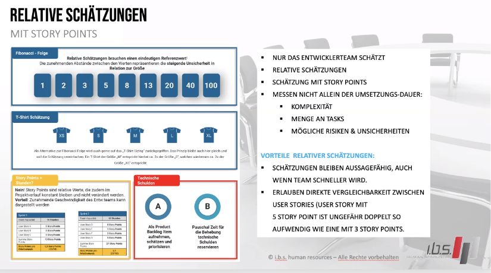

#story-point

_____________________

![[Pasted image 20240808125550.png]]

### Faktoren

- Zeit
- Planungsqualität
- Kundennutzen maximieren
- fibunacci Folge

##  Planning Poker

- Das Team erstellt User Stories und dazugehörigen Tasks
- Jeder entscheidet für sich wie hoch für Ihn der Aufwand wäre
- man verteilt max 3x die Story Points 
- man hinterfragt den höheren und den niedrigsten Wert und bildet 
- findet in der Sprint - Planung statt

## Resourcen Knappheit

- Outsourcen
- Mehrarbeit (Überstunden)
- Verstärung integrieren
- Verschieben der Tasks
- anders aufteilen
- Aufgaben Stauchen (achtung keine einbusung der Qualität erzeugen)
- Überprüfen was kann weggelassen werden
- ins Backlog zurückstellen
- Sprintabbruch
## Story Point Prognose

*Annahmen*
- Entwicklungsteam aus 6 Mitarbeitern